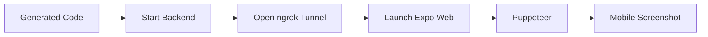
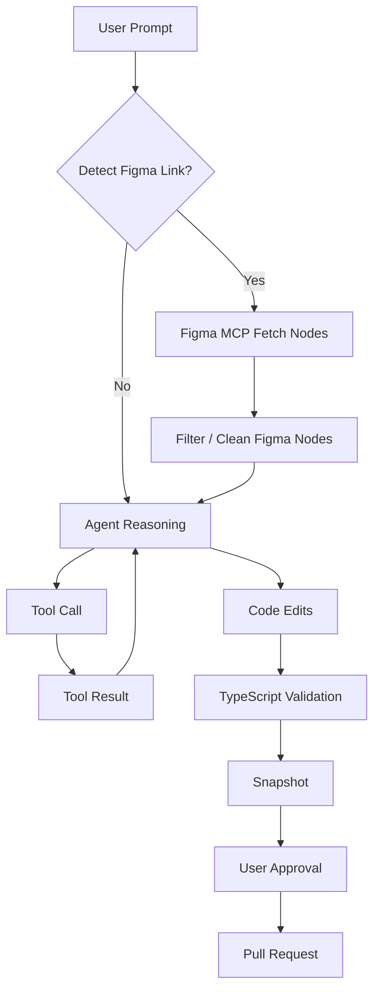
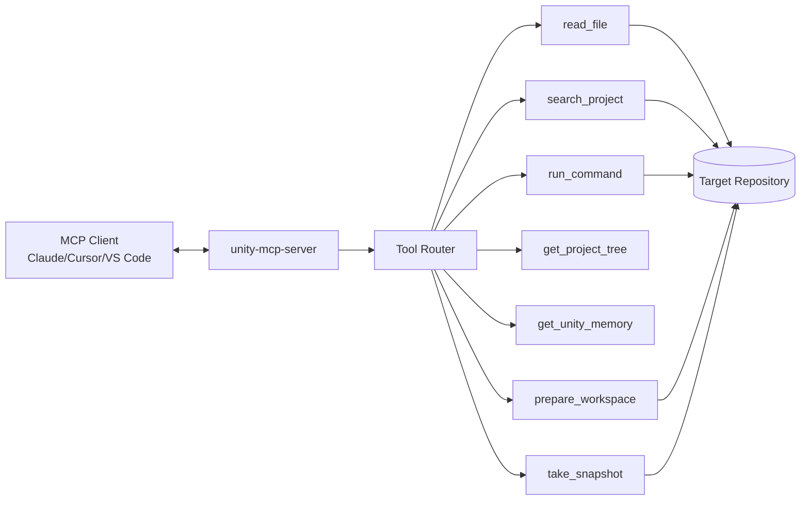
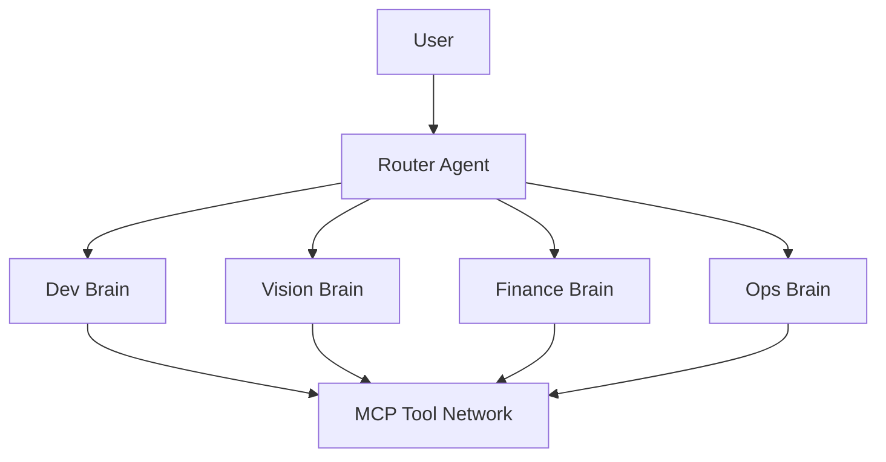

# 🧠 Unity OS

> Because sometimes you need to keep shipping without a computer.

Unity OS is an experimental **autonomous development agent** that works through Discord and applies real code changes in a controlled workspace.

Think of it as **Jarvis for developers**.

Instead of controlling an Iron Man suit, it:

- Reads and edits your code
- Understands your repository architecture
- Installs dependencies
- Runs development commands safely
- Generates pull requests
- Builds UI from Figma
- Runs your app
- Captures screenshots
- And eventually… manages your entire development workflow

Yes, it's ambitious.  
Yes, it's slightly insane.  
And yes — it actually works.

---

# 🚀 What It Does Today

Unity currently operates as a **Discord-driven autonomous development agent**.

Capabilities:

- Reads and edits code through a constrained tool layer
- Scans project architecture and applies `.unityrc.md` rules
- Uses short‑term memory from `git diff` for reply-based iterations
- Installs dependencies and runs safe development commands
- Generates validated TypeScript edits with a self‑healing loop
- Captures Expo screenshots with Puppeteer and returns preview links
- Creates Smart PRs from the final session diff

---

# 🏗 System Architecture

```mermaid
flowchart LR
    U[Discord user in #jarvis-dev] --> D[index.ts]
    D --> W[prepareWorkspace() src/git.ts]
    D --> S[getProjectTree + getProjectMemory src/scanner.ts]
    D --> F[getFigmaContext() src/figma.ts]
    D --> A[generateAndWriteCode() src/ai.ts]
    A --> T[Tool layer src/tools.ts]
    T --> R[(Target repo in workspaces/)]
    A --> C[npx tsc --noEmit validation loop]
    D --> P[takeSnapshot() src/snapshot.ts]
    P --> X[Expo + Puppeteer screenshot]
    D --> PR[Approve button -> createPullRequest()]
```

Unity operates as a **tool‑driven AI system**.

The AI **never directly modifies files or runs arbitrary commands**.  
Everything happens through a controlled tool interface.

---

# ⚙️ Core Components

### `index.ts`
Discord entrypoint responsible for:

- receiving prompts
- managing sessions
- concurrency locking
- approve / revert workflow
- orchestrating the agent pipeline

---

### `src/ai.ts`

The brain of the system.

Handles:

- reasoning loop
- tool orchestration
- JSON edit contract
- TypeScript compiler self‑healing
- smart commit messages

Unity loops until the generated code compiles.

---

### `src/tools.ts`

The tool layer exposed to the AI.

Available tools:

| Tool | Purpose |
|-----|------|
read_file | inspect project files |
search_project | search the repository |
run_command | run safe development commands |

Each tool enforces **path validation and command restrictions**.

---

### `src/git.ts`

Workspace manager.

Handles:

- cloning repositories
- resetting workspace
- installing dependencies
- detecting frontend/backend modules
- creating Pull Requests

---

### `src/scanner.ts`

Builds a **token‑optimized project map**.

Example structure:

```
app/
  login.tsx
components/
  Button.tsx
api/
  auth.ts
```

Also loads:

```
.unityrc.md
```

Which acts as **long‑term architecture memory**.

---

### `src/figma.ts`

Design‑to‑code integration.

Responsibilities:

- parse Figma URLs
- fetch design nodes
- clean and compress node JSON
- cache responses

This provides layout context for the AI.

---

### `src/snapshot.ts`

Preview generation pipeline.



Unity runs the project and returns a **visual preview** of the generated UI.

---

### `utils/register-commands.ts`

Registers Discord slash commands:

```
/workon
/status
/init
```

These control the active workspace.

---

# 🔁 Agent Workflow



The AI gathers context before making any change.

---

# ✂️ Agent Edit Contract

Jarvis writes structured edits:

```json
{
  "targetRoute": "/path",
  "commitMessage": "feat: summary",
  "edits": [
    {
      "filepath": "relative/path.tsx",
      "search": "exact existing code",
      "replace": "new code"
    }
  ]
}
```

Rules:

- If `search` does not match exactly → edit fails safely
- AI must regenerate patch
- prevents destructive overwrites

---

# 🔐 Safety Model

Unity includes several guardrails.

### Path Protection

Blocks paths outside repo root:

```
../
~
/root
```

---

### Command Whitelist

Only safe commands allowed:

```
npm install
npm run
npx expo
npx tsc
```

---

### Workspace Integrity

- prevents overlapping runs
- blocks tasks if repo has uncommitted changes
- edits are applied atomically

---

# 🛠 Installation

## Requirements

- Node.js 18+
- npm
- Git
- Discord bot + application
- GitHub token
- DeepSeek API key
- Figma token (optional)
- ngrok (optional)

---

## Setup

```bash
git clone <your-repo>
cd unity-os
npm install
```

Create `.env`:

```
DISCORD_TOKEN=your_discord_bot_token
DISCORD_CLIENT_ID=your_discord_client_id
GITHUB_TOKEN=your_github_token
GITHUB_OWNER=your_github_org_or_user
GITHUB_REPO=target_repo_name
FIGMA_TOKEN=your_figma_token
DEEPSEEK_API_KEY=your_deepseek_key
```

Register slash commands:

```bash
npx tsx utils/register-commands.ts
```

Start Jarvis:

```bash
npm run dev
```

Expected log:

```
🤖 Jarvis Architect listening on Discord...
```

---

# 💬 Usage

1. Go to `#jarvis-dev`
2. Send a prompt

Example:

```
Create a login screen using our theme tokens
```

Unity will:

1. analyze the repo
2. generate code
3. validate TypeScript
4. run the app
5. capture preview
6. offer Pull Request

Reply to the same message to iterate.

---

# 🔌 MCP Server Blueprint (Future Layer)

Unity can evolve into an **MCP-compatible system**.



### MCP Mapping Plan

- Wrap `src/tools.ts` functions as MCP `tools/call`
- Provide context as MCP `resources`
- Expose workspace + snapshot operations
- Allow external agents to call Unity tools

---

# 🧠 Future Vision

Unity currently runs as a **single development agent**.

Future architecture:



Potential capabilities:

- automated debugging
- receipt analysis
- infrastructure monitoring
- multi‑project development
- personal knowledge orchestration

In other words:

Unity starts as a **developer assistant**  
and evolves into an **AI operating system**.

---

# ⚠️ Disclaimer

Unity can:

- modify repositories
- run commands
- create pull requests

Use responsibly.

Version control is your friend.

---

# 📜 License

MIT

Do whatever you want.

Just maybe don’t build Skynet.
